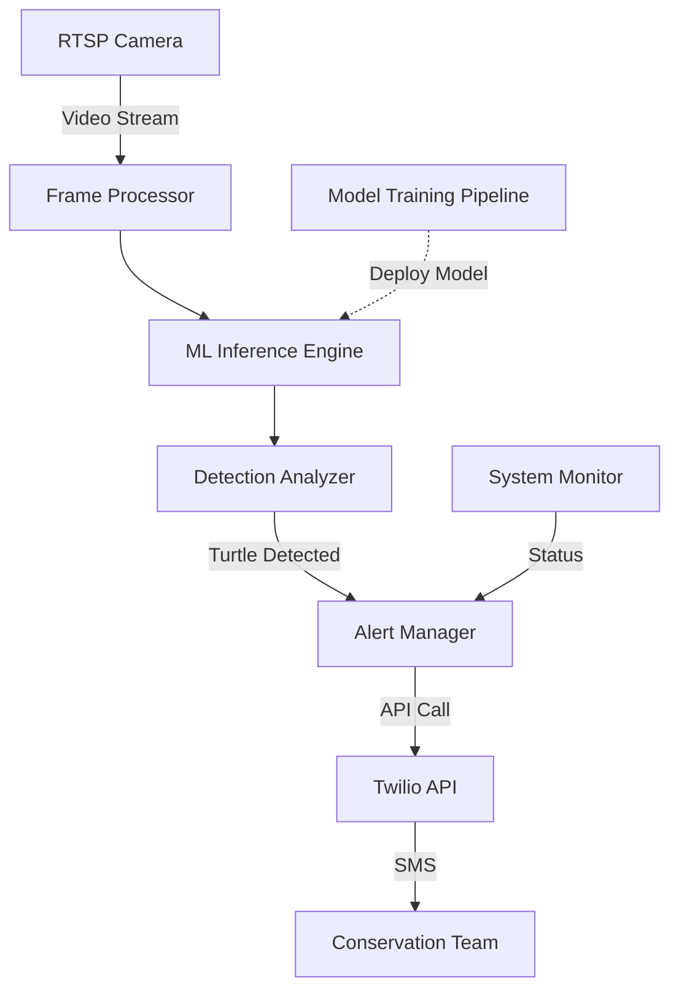

# Pawikan Sentinel – Unified Project File
> AI-powered sea-turtle detection on Raspberry Pi 4B with SMS alerts  
> Generated by merging `requirements.md`, `design.md`, and `tasks.md`

---

## 🔍 1. Requirements
# Requirements Document

## Introduction

The Pawikan Sentinel is a real-time sea turtle detection system designed for conservation efforts. The system uses a Raspberry Pi 4B with an infrared camera to detect nesting sea turtles and automatically alert conservation teams via SMS. The solution employs edge-optimized machine learning with YOLOv5n and multi-stage transfer learning to achieve high accuracy detection within strict hardware constraints.

## Requirements

### Requirement 1

**User Story:** As a conservation team member, I want to receive automatic SMS alerts when sea turtles are detected, so that I can respond quickly to protect nesting turtles.

#### Acceptance Criteria

1. WHEN a sea turtle is detected in the camera feed THEN the system SHALL send an SMS alert within 30 seconds
2. WHEN multiple turtles are detected simultaneously THEN the system SHALL send a single consolidated alert message
3. WHEN the same turtle remains in view THEN the system SHALL NOT send duplicate alerts within a 10-minute window
4. IF SMS delivery fails THEN the system SHALL retry up to 3 times with exponential backoff

### Requirement 2

**User Story:** As a conservation researcher, I want the system to accurately detect sea turtles in infrared camera feeds, so that we minimize false alarms and missed detections.

#### Acceptance Criteria

1. WHEN processing infrared camera frames THEN the system SHALL achieve 85% or higher detection accuracy
2. WHEN analyzing video feeds THEN the system SHALL maintain false positive rates below 10%
3. WHEN a turtle is present in the frame THEN the system SHALL detect it within 2 seconds of appearance
4. IF lighting conditions change THEN the system SHALL maintain consistent detection performance

### Requirement 3

**User Story:** As a system administrator, I want to train and deploy optimized ML models efficiently, so that the detection system can be updated and improved over time.

#### Acceptance Criteria

1. WHEN training models in Google Colab THEN the system SHALL complete full training pipeline within 2-3 GPU sessions
2. WHEN converting models to TensorFlow Lite THEN the system SHALL achieve 3-4x inference speedup on Raspberry Pi
3. WHEN deploying new models THEN the system SHALL validate performance before replacing production model
4. IF model performance degrades THEN the system SHALL automatically rollback to previous stable version

### Requirement 4

**User Story:** As a conservation project manager, I want the system to handle multiple data sources and training stages, so that detection accuracy improves over time with domain-specific learning.

#### Acceptance Criteria

1. WHEN downloading datasets THEN the system SHALL use curl commands to fetch GTST-2023 and SeaTurtleID2022 from Kaggle
2. WHEN preparing datasets THEN the system SHALL combine and process them into a structure compatible with YOLOv5 training scripts
3. WHEN training with GTST-2023 dataset THEN the system SHALL process all annotated frames from the NIR images
4. WHEN augmenting with SeaTurtleID2022 data THEN the system SHALL integrate and convert the format appropriately
5. WHEN performing transfer learning THEN the system SHALL progress through these specific stages:
   - Stage 1: Load YOLOv5n COCO pretrained weights
   - Stage 2: Fine-tune on the combined turtle datasets (GTST-2023 and SeaTurtleID2022) to specialize the model for both NIR and RGB images.
6. IF training data is corrupted or incomplete THEN the system SHALL validate data integrity before training

### Requirement 5

**User Story:** As a field operator, I want the system to integrate seamlessly with existing camera infrastructure, so that deployment requires minimal hardware changes.

#### Acceptance Criteria

1. WHEN connecting to RTSP cameras THEN the system SHALL establish stable video streams within 10 seconds
2. WHEN processing video feeds THEN the system SHALL handle standard RTSP protocols and codecs
3. IF network connectivity is lost THEN the system SHALL buffer detections and send alerts when connection is restored
4. WHEN camera feed quality degrades THEN the system SHALL adjust processing parameters automatically
---

## 🏗️ 2. Design & Architecture
# Pawikan Sentinel Design Document

## Overview

The Pawikan Sentinel is a real-time sea turtle detection system designed for conservation efforts. The system uses a Raspberry Pi 4B with an infrared camera to detect nesting sea turtles and automatically alert conservation teams via SMS. This design document outlines the architecture, components, data models, and implementation strategy for the Pawikan Sentinel system.

The system follows a pipeline architecture where video frames from an RTSP camera are processed through an optimized YOLOv5n model running on a Raspberry Pi 4B. When sea turtles are detected, the system sends SMS alerts to conservation team members via the Twilio API. The ML model is trained through a multi-stage transfer learning approach using Google Colab.

## Architecture

The Pawikan Sentinel system consists of the following high-level components:



### Core Components

1. **Frame Processor**: Captures and preprocesses video frames from the RTSP camera
2. **ML Inference Engine**: Runs the optimized YOLOv5n TFLite model for turtle detection
3. **Detection Analyzer**: Analyzes detection results, filters false positives, and tracks objects
4. **Alert Manager**: Manages alert generation, deduplication, and delivery
5. **Notification Service**: Handles communication with the Twilio API for SMS delivery
6. **System Monitor**: Monitors system health, performance, and resource usage
7. **Model Training Pipeline**: Google Colab-based pipeline for multi-stage transfer learning

## Components and Interfaces

### 1. Dataset Processor

**Responsibility**: Download, process, and prepare datasets for YOLO training

**Interfaces**:
- **Input**: URLs to GTST-2023 and SeaTurtleID2022 datasets
- **Output**: Combined dataset in YOLO-compatible format
- **Configuration**: Dataset paths, processing parameters

**Key Functions**:
- Download datasets using curl commands from Kaggle
- Extract and organize dataset files
- Convert annotations to YOLO format (normalized bounding boxes)
- Create proper directory structure (images/train, images/val, labels/train, labels/val)
- Generate dataset.yaml configuration file for YOLOv5
- Combine GTST-2023 and SeaTurtleID2022 datasets
- Compress processed dataset for Google Drive upload
- Verify dataset integrity and completeness

**Performance Requirements**:
- Process complete datasets efficiently
- Maintain annotation accuracy during conversion
- Generate valid YOLO-compatible format
- Support incremental dataset updates

### 2. Frame Processor

**Responsibility**: Capture frames from RTSP camera, preprocess for inference

**Interfaces**:
- **Input**: RTSP video stream (configurable URL, credentials)
- **Output**: Preprocessed frames ready for inference
- **Configuration**: Frame rate, resolution, preprocessing parameters

**Key Functions**:
- RTSP connection management with automatic reconnection
- Frame decoding and format conversion
- Preprocessing (resizing, normalization)
- Frame buffering and rate control

**Performance Requirements**:
- Process minimum 10 FPS at 640x480 resolution
- Maintain stable connection with RTSP source
- Graceful handling of connection interruptions

### 3. ML Inference Engine

**Responsibility**: Run optimized YOLOv5n model on preprocessed frames

**Interfaces**:
- **Input**: Preprocessed frames from Frame Processor
- **Output**: Raw detection results (bounding boxes, confidence scores, class IDs)
- **Configuration**: Model path, inference parameters, hardware acceleration options

**Key Functions**:
- TensorFlow Lite model loading and initialization
- Inference execution with hardware acceleration when available
- Batch processing for efficiency
- Model versioning and hot-swapping

**Performance Requirements**:
- <2 second inference latency per frame
- Efficient memory usage (<4GB RAM)
- Support for INT8 quantized models

### 4. Detection Analyzer

**Responsibility**: Process raw detections, filter results, track objects

**Interfaces**:
- **Input**: Raw detection results from ML Inference Engine
- **Output**: Analyzed detection events with metadata
- **Configuration**: Confidence thresholds, NMS parameters, tracking settings

**Key Functions**:
- Non-maximum suppression for overlapping detections
- Confidence thresholding
- Object tracking across frames
- False positive filtering
- Detection event generation

**Performance Requirements**:
- Process detection results in <100ms
- Maintain object identity across frames
- Filter >90% of false positives

### 5. Alert Manager

**Responsibility**: Generate and manage alerts based on detection events

**Interfaces**:
- **Input**: Detection events from Detection Analyzer
- **Output**: Alert messages to Notification Service
- **Configuration**: Alert rules, throttling settings, message templates

**Key Functions**:
- Alert generation based on detection events
- Deduplication within time windows (10-minute)
- Alert prioritization and throttling
- Delivery confirmation and retry logic
- Alert logging and statistics

**Performance Requirements**:
- Generate alerts within 1 second of detection event
- Maintain alert history for reporting
- Support configurable alert rules

### 6. Notification Service

**Responsibility**: Communicate with the Twilio API for SMS delivery

**Interfaces**:
- **Input**: Alert messages from Alert Manager
- **Output**: HTTP requests to the Twilio API
- **Configuration**: Twilio Account SID, Auth Token, and phone number

**Key Functions**:
- Construct and send API requests using the Twilio Python helper library
- Handle API authentication
- Parse API responses for delivery status
- Implement error handling and retry logic for API requests
- Support multiple recipient numbers

**Performance Requirements**:
- Send SMS within 5 seconds of alert generation
- Handle API errors and network issues gracefully

### 7. System Monitor

**Responsibility**: Monitor system health and performance

**Interfaces**:
- **Input**: System metrics (CPU, memory, temperature, storage)
- **Output**: Status reports, alerts for system issues
- **Configuration**: Monitoring thresholds, reporting frequency

**Key Functions**:
- Resource usage monitoring
- Temperature monitoring
- Storage management
- Performance metrics collection
- System health reporting

**Performance Requirements**:
- Minimal impact on system resources (<5% CPU)
- Early detection of potential issues
- Automatic log rotation and management

### 8. Model Training Pipeline

**Responsibility**: Train and optimize ML models through multi-stage transfer learning

**Interfaces**:
- **Input**: Training datasets (GTST-2023, SeaTurtleID2022)
- **Output**: Optimized TFLite models
- **Configuration**: Training hyperparameters, dataset paths

**Key Functions**:
- Dataset download using curl commands from Kaggle
- Dataset preparation and preprocessing for YOLOv5 compatibility
- Transfer learning execution:
  - Stage 1: Load YOLOv5n COCO pretrained weights
  - Stage 2: Specialize on turtle datasets (GTST-2023 + SeaTurtleID2022)
- TensorBoard integration for training monitoring
- Model evaluation and validation at each stage
- ONNX conversion and TensorFlow Lite INT8 quantization
- Model versioning and packaging

**Performance Requirements**:
- Complete training pipeline in <2-3 Colab sessions
- Achieve 3-4x speedup through TFLite optimization
- Maintain model accuracy ≥85%
- Handle Colab session timeout with checkpoint saving

## Data Models

### 1. Frame

```python
class Frame:
    timestamp: datetime      # Frame capture time
    image: numpy.ndarray     # Image data
    source_id: str           # Camera identifier
    resolution: Tuple[int]   # Width, height
    format: str              # Image format (RGB, BGR, etc.)
    metadata: Dict           # Additional metadata
```

### 2. Detection

```python
class Detection:
    frame_id: str            # Reference to source frame
    timestamp: datetime      # Detection time
    bbox: List[float]        # [x1, y1, x2, y2] normalized coordinates
    confidence: float        # Detection confidence (0-1)
    class_id: int            # Class identifier (0 = turtle)
    track_id: Optional[int]  # Object tracking ID
```

### 3. DetectionEvent

```python
class DetectionEvent:
    id: str                  # Unique event identifier
    timestamp: datetime      # Event time
    detections: List[Detection]  # Associated detections
    confidence: float        # Overall event confidence
    duration: float          # Event duration in seconds
    metadata: Dict           # Additional event metadata
```

### 4. Alert

```python
class Alert:
    id: str                  # Unique alert identifier
    event_id: str            # Reference to detection event
    timestamp: datetime      # Alert generation time
    message: str             # Alert message content
    recipients: List[str]    # List of recipient numbers
    status: str              # Alert status (pending, sent, delivered, failed)
    retry_count: int         # Number of delivery attempts
    metadata: Dict           # Additional alert metadata
```

### 5. ModelVersion

```python
class ModelVersion:
    id: str                  # Model version identifier
    timestamp: datetime      # Creation timestamp
    file_path: str           # Path to model file
    format: str              # Model format (TFLite)
    performance: Dict        # Performance metrics
    training_metadata: Dict  # Training information
    status: str              # Model status (active, inactive, failed)
```

## Error Handling

### 1. Camera Connection Failures

- Implement automatic reconnection with exponential backoff
- Cache last known good frame for continuity
- Log connection issues with diagnostics
- Alert system administrator after persistent failures

### 2. Inference Errors

- Implement model execution timeout (5 seconds max)
- Catch and log TFLite runtime errors
- Fall back to previous model version on persistent errors
- Monitor and report inference performance degradation

### 3. Twilio API Communication Failures

- Implement command timeout and retry logic for API calls
- Buffer alerts during network or API outages
- Provide diagnostic logging for API interactions
- Support alternative alert delivery methods as fallback

### 4. System Resource Constraints

- Implement adaptive frame rate based on system load
- Monitor memory usage and implement garbage collection
- Throttle processing during thermal events
- Implement graceful degradation of non-critical functions

### 5. Data Integrity Issues

- Validate all incoming frames before processing
- Implement checksums for model files
- Verify detection results before alert generation
- Maintain audit logs for system operations

## Testing Strategy

### 1. Unit Testing

- Test individual components with mock interfaces
- Validate component behavior under normal and error conditions
- Achieve >80% code coverage for core components
- Automate unit tests for CI/CD pipeline

### 2. Integration Testing

- Test component interactions with simulated data
- Validate end-to-end alert generation pipeline
- Test system behavior under resource constraints
- Verify error handling and recovery mechanisms

### 3. Model Validation

- Test model performance on validation dataset
- Benchmark inference speed on target hardware
- Validate model behavior with edge cases
- Compare performance metrics against requirements

### 4. System Testing

- Test full system with actual RTSP camera feed
- Validate SMS delivery with a Twilio test account
- Measure end-to-end latency from frame to alert
- Test system stability over extended periods

### 5. Field Testing

- Deploy system in controlled environment
- Monitor performance with real-world data
- Collect feedback from conservation team
- Iterate based on field performance

## Implementation Plan

The implementation will follow a phased approach aligned with the 4-5 week timeline:

### Phase 1: Dataset Preparation & Training Setup (Week 1)

- Set up Google Colab environment with GPU acceleration
- Implement dataset download and preprocessing scripts
- Prepare GTST-2023 and SeaTurtleID2022 datasets
- Configure TensorBoard monitoring

### Phase 2: Model Training & Optimization (Week 1-2)

- Implement transfer learning pipeline
- Load COCO pretrained weights
- Specialize model on the combined turtle datasets
- Convert and optimize for TensorFlow Lite

### Phase 3: Raspberry Pi Core Components (Week 2-3)

- Set up Raspberry Pi 4B development environment
- Implement Frame Processor for RTSP integration
- Develop ML Inference Engine for TFLite models
- Create Detection Analyzer with object tracking
- Implement System Monitor

### Phase 4: Alert System Integration (Week 3-4)

- Implement Alert Manager with deduplication logic
- Develop Notification Service for SMS delivery via the Twilio API
- Integrate components into end-to-end pipeline
- Implement error handling and recovery mechanisms

### Phase 5: Testing & Deployment (Week 4-5)

- Conduct comprehensive testing of all components
- Optimize performance based on test results
- Deploy system in conservation center
- Train conservation team on system operation
- Monitor initial deployment and iterate as needed

## Deployment Architecture

The final deployment will consist of:

1. **Hardware**:
   - Raspberry Pi 4B (8GB RAM)
   - RTSP-capable infrared camera
   - Appropriate power supply and cooling

2. **Software**:
   - Raspbian OS (64-bit)
   - Python 3.9+ runtime
   - TensorFlow Lite runtime
   - Pawikan Sentinel application
   - Systemd service for automatic startup

3. **Configuration**:
   - Camera connection parameters
   - Model settings and paths
   - Alert rules and recipient numbers
   - Twilio Account SID, Auth Token, and phone number
   - System monitoring thresholds

4. **Documentation**:
   - Installation guide
   - Operation manual
   - Troubleshooting procedures
   - Maintenance instructions
---

## ✅ 3. Implementation Tasks & Progress
# Implementation Plan

This implementation plan outlines the specific coding tasks required to build the Pawikan Sentinel system. Each task is designed to be actionable and build incrementally on previous steps, following a test-driven development approach where appropriate.

## Dataset Processing and Training Pipeline

- [x] 1. Create dataset download scripts
  - Implement bash scripts to download GTST-2023 and SeaTurtleID2022 datasets using curl commands
  - Add error handling and download verification
  - Include progress indicators and resumable downloads
  - _Requirements: 4.1_

- [x] 2. Implement dataset processing utilities
  - [x] 2.1 Create GTST-2023 preprocessing module
    - Extract frames from video files if needed
    - Convert annotations to YOLO format (normalized bounding boxes)
    - Split data into train/val/test sets
    - _Requirements: 4.2, 4.3_
  
  - [x] 2.2 Create SeaTurtleID2022 preprocessing module
    - Process RGB images and annotations
    - Convert to YOLO format
    - Implement data augmentation for domain adaptation
    - _Requirements: 4.2, 4.4_
  
  - [x] 2.3 Implement dataset combination utility
    - Merge processed datasets with consistent labeling
    - Generate dataset.yaml configuration for YOLOv5
    - Create directory structure compatible with YOLOv5
    - Implement dataset verification and validation
    - _Requirements: 4.2, 4.5_

- [x] 3. Develop Google Colab training notebook
  - [x] 3.1 Set up Colab environment configuration
    - Configure GPU runtime
    - Install dependencies and YOLOv5 requirements
    - Implement Google Drive integration with gdown
    - Set up TensorBoard logging
    - _Requirements: 3.1, 4.5_
  
  - [x] 3.2 Implement transfer learning pipeline
    - Create Stage 1: Load and verify COCO pretrained weights
    - Create Stage 2: Specialize on combined turtle datasets (GTST-2023 and SeaTurtleID2022)
    - Implement checkpoint saving
    - _Requirements: 3.1, 4.5_
  
  - [x] 3.3 Develop model evaluation and validation
    - Implement metrics calculation (precision, recall, mAP)
    - Create visualization tools for validation results
    - Add early stopping based on validation metrics
    - Implement cross-validation for hyperparameter tuning
    - _Requirements: 2.1, 2.2, 3.1_

- [x] 4. Create model optimization pipeline
  - [x] 4.1 Implement ONNX conversion
    - Convert trained PyTorch model to ONNX format
    - Validate ONNX model correctness
    - Optimize ONNX graph for inference
    - _Requirements: 3.2_
  
  - [x] 4.2 Implement TensorFlow Lite conversion
    - Convert ONNX model to TFLite format
    - Apply INT8 quantization
    - Implement post-training quantization techniques
    - Validate accuracy retention after quantization
    - _Requirements: 3.2_
  
  - [x] 4.3 Create model benchmarking tools
    - Implement inference speed measurement
    - Create memory usage profiling
    - Compare model versions and optimizations
    - Generate benchmark reports
    - _Requirements: 3.2, 3.3_

## Raspberry Pi Application Development

- [x] 5. Set up Raspberry Pi development environment
  - Configure Raspbian OS with required dependencies
  - Install TensorFlow Lite runtime
  - Set up development tools and libraries
  - Configure remote development workflow
  - _Requirements: 3.3_

- [x] 6. Implement Frame Processor
  - [x] 6.1 Create RTSP client module
    - Implement connection to RTSP camera
    - Add authentication and secure connection handling
    - Create automatic reconnection logic
    - Implement stream configuration management
    - _Requirements: 5.1, 5.2_
  
  - [x] 6.2 Develop frame preprocessing pipeline
    - Implement frame decoding and format conversion
    - Create resizing and normalization functions
    - Add frame buffering and rate control
    - Optimize for Raspberry Pi performance
    - _Requirements: 2.3_

- [x] 7. Implement ML Inference Engine
  - [x] 7.1 Create TFLite model loader
    - Implement model file loading and initialization
    - Add model version management
    - Create interpreter configuration for optimal performance
    - Implement error handling for model loading
    - _Requirements: 3.3_
  
  - [x] 7.2 Develop inference execution module
    - Implement efficient tensor allocation
    - Create batched inference processing
    - Optimize for ARM CPU performance
    - Add inference timing and statistics
    - _Requirements: 2.3, 3.2_

- [x] 8. Implement Detection Analyzer
  - [x] 8.1 Create detection post-processing module
    - Implement non-maximum suppression
    - Add confidence thresholding
    - Create bounding box conversion utilities
    - Implement class filtering
    - _Requirements: 2.1, 2.2_
  
  - [x] 8.2 Develop object tracking system
    - Implement object tracking across frames
    - Create unique ID assignment for detected turtles
    - Add trajectory prediction and smoothing
    - Implement track management and pruning
    - _Requirements: 1.3_

- [x] 9. Implement Alert Manager
  - [x] 9.1 Create alert generation module
    - Implement detection event creation
    - Add alert deduplication within time windows
    - Create alert prioritization logic
    - Implement alert formatting and templating
    - _Requirements: 1.1, 1.2, 1.3_
  
  - [x] 9.2 Develop alert delivery system
    - Implement alert queuing and retry logic
    - Add delivery confirmation tracking
    - Create alert logging and statistics
    - Implement alert history management
    - _Requirements: 1.1, 1.4_

- [x] 10. Implement Notification Service
  - [x] 10.1 Create Twilio API client module
    - Implement a wrapper for the Twilio API using the official Python library
    - Add error handling and response parsing
    - Create configuration for API keys, SIDs, and phone numbers
    - Implement connection management
    - _Requirements: 1.1, 1.4_
  
  - [x] 10.2 Develop SMS messaging module
    - Implement SMS message formatting
    - Add recipient management
    - Create delivery status monitoring from API responses
    - Implement retry logic for failed API requests
    - _Requirements: 1.1, 1.2, 1.4_

- [x] 11. Implement System Monitor
  - [x] 11.1 Create resource monitoring module
    - Implement CPU, memory, and temperature monitoring
    - Add storage usage tracking
    - Create performance metrics collection
    - Implement threshold-based alerts
    - _Requirements: 5.3_
  
  - [x] 11.2 Develop logging and reporting system
    - Implement structured logging
    - Add log rotation and management
    - Create status reporting
    - Implement diagnostic tools
    - _Requirements: 5.3_

## Integration and Testing

- [x] 12. Develop comprehensive test suite
  - [x] 12.1 Create unit tests for core components
    - Implement tests for each module
    - Add mock interfaces for dependencies
    - Create test data generators
    - Implement test automation
    - _Requirements: 2.1, 3.3_
  
  - [x] 12.2 Implement integration tests
    - Create end-to-end test scenarios
    - Add performance and stress tests
    - Implement error injection and recovery tests
    - Create test reporting and visualization
    - _Requirements: 2.1, 2.2, 2.3_

- [x] 13. Create system integration
  - [x] 13.1 Implement main application
    - Create component initialization and configuration
    - Add graceful startup and shutdown
    - Implement component coordination
    - Create error handling and recovery
    - _Requirements: 5.1, 5.3_
  
  - [x] 13.2 Develop configuration management
    - Implement configuration file loading
    - Add parameter validation
    - Create dynamic configuration updates
    - Implement configuration backup and restore
    - _Requirements: 5.2, 5.3_
  
  - [x] 13.3 Create systemd service
    - Implement service definition
    - Add automatic startup configuration
    - Create service monitoring and recovery
    - Implement logging integration
    - _Requirements: 5.1, 5.3_

- [x] 14. Implement deployment utilities
  - [x] 14.1 Create installation script
    - Implement dependency installation
    - Add configuration setup
    - Create directory structure initialization
    - Implement permission management
    - _Requirements: 3.3_
  
  - [x] 14.2 Develop update mechanism
    - Implement model update procedure
    - Add application code updates
    - Create configuration migration
    - Implement rollback capability
    - _Requirements: 3.3, 3.4_
