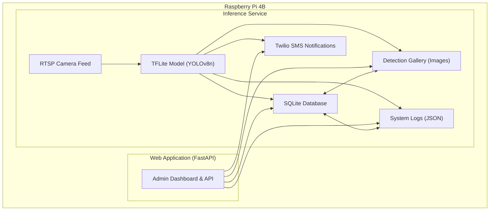

# Pawikan Sentinel

**ML-powered sea-turtle detection on Raspberry Pi 4B with real-time SMS alerts.**

Pawikan Sentinel is a system designed for wildlife conservation, specifically for monitoring and protecting nesting sea turtles. It uses an edge-optimized custom machine learning model fine-tuned with YOLOv8n on a Raspberry Pi 4B to analyze infrared camera feeds, detect turtles, and automatically send SMS alerts to conservation teams via Twilio.

## Key Features

-   **Real-Time Detection:** Employs an optimized YOLOv5n model to detect sea turtles from an RTSP camera feed with high accuracy.
-   **Automated SMS Alerts:** Instantly notifies conservation teams via SMS when a turtle is detected, enabling rapid response.
-   **Edge Computing:** All processing is done on a Raspberry Pi 4B, making it ideal for remote locations with limited internet bandwidth.
*   **Secure Admin Dashboard**: Manage system settings, API secrets, and personnel contacts.
*   **Analytics & Visualization**: View detection event trends and data.
*   **Detection Frame Gallery**: Browse annotated detection images.
*   **Personnel & Notification Management**: Configure contacts and notification settings.
*   **Comprehensive Logging**: Access structured JSON logs for diagnostics.

## System Architecture

The Pawikan Sentinel system operates on a Raspberry Pi and is composed of two primary services:

1.  **Inference Service**: This background service continuously processes video streams from an RTSP camera. It uses a TFLite Model to detect turtles, then stores detection data in a SQLite Database, saves annotated images to a Detection Gallery, and records events in System Logs. It also triggers SMS Notifications for critical events.

2.  **Web Application**: This FastAPI-based web interface provides an Admin Web Interface for users. It interacts with the SQLite Database to manage settings and view analytics, accesses the Detection Gallery to display images, and retrieves information from System Logs. It also allows for the management of SMS Notification settings.

Both services run concurrently on the Raspberry Pi, sharing data through the centralized SQLite Database, Detection Gallery, and System Logs.

