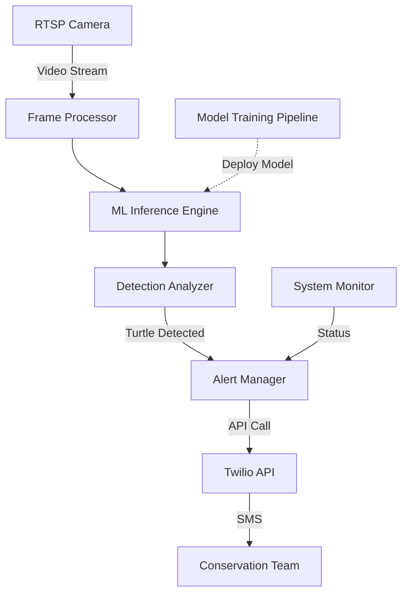

# Pawikan Sentinel

AI-powered sea-turtle detection on Raspberry Pi 4B with SMS alerts.

## Overview

The Pawikan Sentinel is a real-time sea turtle detection system designed for conservation efforts. The system uses a Raspberry Pi 4B with an infrared camera to detect nesting sea turtles and automatically alert conservation teams via SMS. The solution employs edge-optimized machine learning with YOLOv5n and multi-stage transfer learning to achieve high accuracy detection within strict hardware constraints.

## Dataset Sources

The model was trained on a combination of the following datasets:

*   **GTST-2023**: [https://www.kaggle.com/datasets/sabasylvester/global-sea-turtle-dataset-2023-gtst-2023](https://www.kaggle.com/datasets/sabasylvester/global-sea-turtle-dataset-2023-gtst-2023)
*   **SeaTurtleID2022**: [https://www.kaggle.com/datasets/wildlifedatasets/seaturtleid2022](https://www.kaggle.com/datasets/wildlifedatasets/seaturtleid2022)

## Project Pipeline

```mermaid
graph TD
    A[RTSP Camera] -->|Video Stream| B[Frame Processor]
    B --> C[ML Inference Engine]
    C --> D[Detection Analyzer]
    D -->|Turtle Detected| E[Alert Manager]
    E -->|API Call| F[Twilio API]
    F -->|SMS| G[Conservation Team]
    H[Model Training Pipeline] -.->|Deploy Model| C
    I[System Monitor] -->|Status| E
```