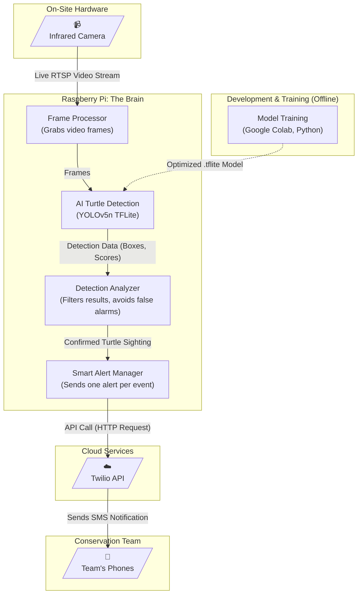

# Pawikan Sentinel

**AI-powered sea-turtle detection on Raspberry Pi 4B with real-time SMS alerts.**

Pawikan Sentinel is a system designed for wildlife conservation, specifically for monitoring and protecting nesting sea turtles. It uses an edge-optimized machine learning model (YOLOv5n) on a Raspberry Pi 4B to analyze infrared camera feeds, detect turtles in real-time, and automatically send SMS alerts to conservation teams via Twilio.

## ✨ Key Features

-   **Real-Time Detection:** Employs an optimized YOLOv5n model to detect sea turtles from an RTSP camera feed with high accuracy.
-   **Automated SMS Alerts:** Instantly notifies conservation teams via SMS when a turtle is detected, enabling rapid response.
-   **Edge Computing:** All processing is done on a Raspberry Pi 4B, making it ideal for remote locations with limited internet bandwidth.
-   **Intelligent Alerting:** Includes alert deduplication to avoid flooding users with notifications for the same event.
-   **Robust and Monitored:** The system is designed for reliability with automatic reconnection, error handling, and system monitoring.

## 🏗️ Architecture

The system is built on a modular pipeline architecture, where each component handles a specific part of the detection and alerting process.


```mermaid
graph TD
    subgraph "On-Site Hardware"
        A[/"📹<br>Infrared Camera"/];
    end

    subgraph "Raspberry Pi: The Brain"
        direction LR
        B["Frame Processor<br>(Grabs video frames)"];
        C["AI Turtle Detection<br>(YOLOv5n TFLite)"];
        D["Detection Analyzer<br>(Filters results, avoids false alarms)"];
        E["Smart Alert Manager<br>(Sends one alert per event)"];
    end

    subgraph "Cloud Services"
        F[/"☁️<br>Twilio API"/];
    end

    subgraph "Conservation Team"
        G[/"📱<br>Team's Phones"/];
    end

    subgraph "Development & Training (Offline)"
        H["Model Training<br>(Google Colab, Python)"];
    end

    A -- "Live RTSP Video Stream" --> B;
    B -- "Frames" --> C;
    C -- "Detection Data (Boxes, Scores)" --> D;
    D -- "Confirmed Turtle Sighting" --> E;
    E -- "API Call (HTTP Request)" --> F;
    F -- "Sends SMS Notification" --> G;
    H -. "Optimized .tflite Model" .-> C;
```

## 🚀 Getting Started

### Prerequisites

-   Raspberry Pi 4B (4GB or 8GB recommended)
-   RTSP-capable (e.g., infrared) camera
-   A Twilio account with a phone number, Account SID, and Auth Token

### Installation

1.  **Clone the repository:**
    ```bash
    git clone https://github.com/zirdl/PawikanSentinel.git
    cd PawikanSentinel
    ```

2.  **Run the installation script:**
    This script will install the required system packages and set up a Python virtual environment.
    ```bash
    bash install.sh
    ```

### Configuration

1.  **Activate the virtual environment:**
    ```bash
    source .venv/bin/activate
    ```

2.  **Create the configuration file:**
    Copy the example configuration file and edit it to add your specific settings. A `config.ini` file is required for the application to run.
    ```bash
    cp config.ini.example config.ini
    nano config.ini
    ```
    You will need to fill in:
    -   RTSP camera stream URL
    -   Twilio Account SID, Auth Token, and phone numbers
    -   Inference confidence thresholds

### Running the Application

-   **To run the main application:**
    ```bash
    python src/main.py
    ```

-   **To send a test SMS:**
    Make sure your `config.ini` is configured, then run:
    ```bash
    python send_test_sms.py "Your message here"
    ```

## 📚 Project Documentation

This repository contains several guides to help you set up, use, and test the Pawikan Sentinel system.

-   **[RPI_SETUP.md](RPI_SETUP.md):** A detailed guide on how to set up the Raspberry Pi from scratch, including OS installation and configuration.
-   **[DEPLOYMENT_RPI.md](DEPLOYMENT_RPI.md):** Instructions for deploying and running the Pawikan Sentinel application on the Raspberry Pi.
-   **[TESTING_GUIDE.md](TESTING_GUIDE.md):** Information on how to run the included tests to verify that the system is working correctly.
-   **[WEB_DASHBOARD_PLAN.md](WEB_DASHBOARD_PLAN.md):** Outlines the future plan for a web-based dashboard for monitoring and managing the system.

## 🧪 Dataset Sources

The detection model was trained using a multi-stage transfer learning approach on a combination of two public datasets:

-   **GTST-2023**: [Global Sea Turtle Dataset 2023](https://www.kaggle.com/datasets/irwandihipiny/gtst-2023)
-   **SeaTurtleID2022**: [SeaTurtleID2022](https://www.kaggle.com/datasets/wildlifedatasets/seaturtleid2022)

## 🔮 Future Work

A web dashboard for remote monitoring and management is planned as a future enhancement. This will allow users to view the live camera feed, see a history of detection events, and manage team contact information from a web browser.

## 📄 License

This project is licensed under the MIT License. See the `LICENSE` file for details.
