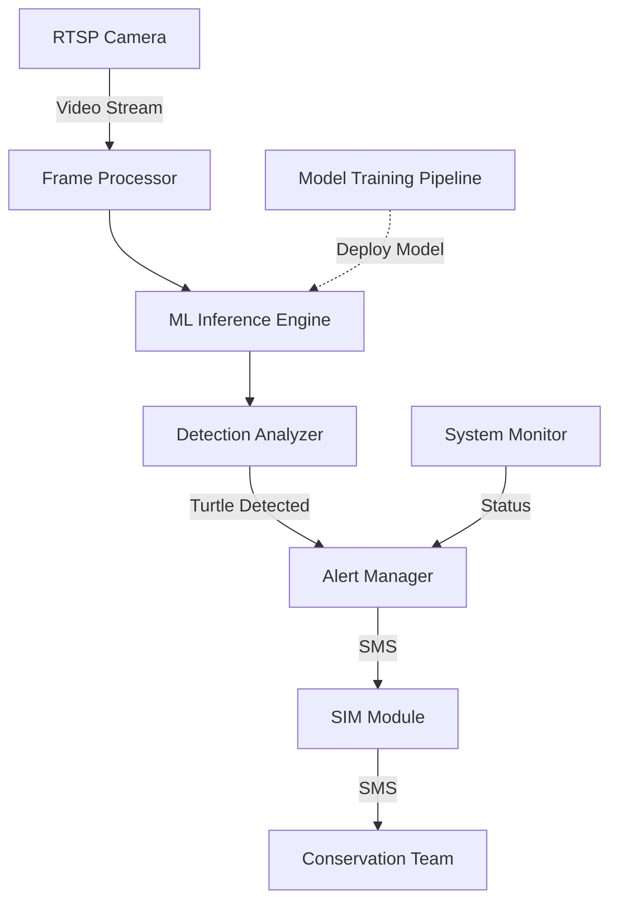

# Pawikan Sentinel Design Document

## Overview

The Pawikan Sentinel is a real-time sea turtle detection system designed for conservation efforts. The system uses a Raspberry Pi 4B with an infrared camera to detect nesting sea turtles and automatically alert conservation teams via SMS. This design document outlines the architecture, components, data models, and implementation strategy for the Pawikan Sentinel system.

The system follows a pipeline architecture where video frames from an RTSP camera are processed through an optimized YOLOv5n model running on a Raspberry Pi 4B. When sea turtles are detected, the system sends SMS alerts to conservation team members via a SIM module. The ML model is trained through a multi-stage transfer learning approach using Google Colab.

## Architecture

The Pawikan Sentinel system consists of the following high-level components:



### Core Components

1. **Frame Processor**: Captures and preprocesses video frames from the RTSP camera
2. **ML Inference Engine**: Runs the optimized YOLOv5n TFLite model for turtle detection
3. **Detection Analyzer**: Analyzes detection results, filters false positives, and tracks objects
4. **Alert Manager**: Manages alert generation, deduplication, and delivery
5. **SIM Module Interface**: Handles communication with the SIM800/900 module for SMS delivery
6. **System Monitor**: Monitors system health, performance, and resource usage
7. **Model Training Pipeline**: Google Colab-based pipeline for multi-stage transfer learning

## Components and Interfaces

### 1. Dataset Processor

**Responsibility**: Download, process, and prepare datasets for YOLO training

**Interfaces**:
- **Input**: URLs to GTST-2023 and SeaTurtleID2022 datasets
- **Output**: Combined dataset in YOLO-compatible format
- **Configuration**: Dataset paths, processing parameters

**Key Functions**:
- Download datasets using curl commands from Kaggle
- Extract and organize dataset files
- Convert annotations to YOLO format (normalized bounding boxes)
- Create proper directory structure (images/train, images/val, labels/train, labels/val)
- Generate dataset.yaml configuration file for YOLOv5
- Combine GTST-2023 and SeaTurtleID2022 datasets
- Compress processed dataset for Google Drive upload
- Verify dataset integrity and completeness

**Performance Requirements**:
- Process complete datasets efficiently
- Maintain annotation accuracy during conversion
- Generate valid YOLO-compatible format
- Support incremental dataset updates

### 2. Frame Processor

**Responsibility**: Capture frames from RTSP camera, preprocess for inference

**Interfaces**:
- **Input**: RTSP video stream (configurable URL, credentials)
- **Output**: Preprocessed frames ready for inference
- **Configuration**: Frame rate, resolution, preprocessing parameters

**Key Functions**:
- RTSP connection management with automatic reconnection
- Frame decoding and format conversion
- Preprocessing (resizing, normalization)
- Frame buffering and rate control

**Performance Requirements**:
- Process minimum 10 FPS at 640x480 resolution
- Maintain stable connection with RTSP source
- Graceful handling of connection interruptions

### 3. ML Inference Engine

**Responsibility**: Run optimized YOLOv5n model on preprocessed frames

**Interfaces**:
- **Input**: Preprocessed frames from Frame Processor
- **Output**: Raw detection results (bounding boxes, confidence scores, class IDs)
- **Configuration**: Model path, inference parameters, hardware acceleration options

**Key Functions**:
- TensorFlow Lite model loading and initialization
- Inference execution with hardware acceleration when available
- Batch processing for efficiency
- Model versioning and hot-swapping

**Performance Requirements**:
- <2 second inference latency per frame
- Efficient memory usage (<4GB RAM)
- Support for INT8 quantized models

### 4. Detection Analyzer

**Responsibility**: Process raw detections, filter results, track objects

**Interfaces**:
- **Input**: Raw detection results from ML Inference Engine
- **Output**: Analyzed detection events with metadata
- **Configuration**: Confidence thresholds, NMS parameters, tracking settings

**Key Functions**:
- Non-maximum suppression for overlapping detections
- Confidence thresholding
- Object tracking across frames
- False positive filtering
- Detection event generation

**Performance Requirements**:
- Process detection results in <100ms
- Maintain object identity across frames
- Filter >90% of false positives

### 5. Alert Manager

**Responsibility**: Generate and manage alerts based on detection events

**Interfaces**:
- **Input**: Detection events from Detection Analyzer
- **Output**: Alert messages to SIM Module Interface
- **Configuration**: Alert rules, throttling settings, message templates

**Key Functions**:
- Alert generation based on detection events
- Deduplication within time windows (10-minute)
- Alert prioritization and throttling
- Delivery confirmation and retry logic
- Alert logging and statistics

**Performance Requirements**:
- Generate alerts within 1 second of detection event
- Maintain alert history for reporting
- Support configurable alert rules

### 6. SIM Module Interface

**Responsibility**: Communicate with SIM800/900 module for SMS delivery

**Interfaces**:
- **Input**: Alert messages from Alert Manager
- **Output**: SMS commands to SIM module via UART/USB
- **Configuration**: SIM module settings, UART/USB parameters

**Key Functions**:
- Serial communication with SIM module
- AT command generation and parsing
- SMS message formatting
- Delivery status monitoring
- Error handling and recovery

**Performance Requirements**:
- Send SMS within 5 seconds of alert generation
- Handle communication errors gracefully
- Support multiple recipient numbers

### 7. System Monitor

**Responsibility**: Monitor system health and performance

**Interfaces**:
- **Input**: System metrics (CPU, memory, temperature, storage)
- **Output**: Status reports, alerts for system issues
- **Configuration**: Monitoring thresholds, reporting frequency

**Key Functions**:
- Resource usage monitoring
- Temperature monitoring
- Storage management
- Performance metrics collection
- System health reporting

**Performance Requirements**:
- Minimal impact on system resources (<5% CPU)
- Early detection of potential issues
- Automatic log rotation and management

### 8. Model Training Pipeline

**Responsibility**: Train and optimize ML models through multi-stage transfer learning

**Interfaces**:
- **Input**: Training datasets (GTST-2023, SeaTurtleID2022)
- **Output**: Optimized TFLite models
- **Configuration**: Training hyperparameters, dataset paths

**Key Functions**:
- Dataset download using curl commands from Kaggle
- Dataset preparation and preprocessing for YOLOv5 compatibility
- Multi-stage transfer learning execution:
  - Stage 1: Load YOLOv5n COCO pretrained weights
  - Stage 2: Fine-tune on general wildlife/animal datasets
  - Stage 3: Specialize on turtle datasets (GTST-2023 + SeaTurtleID2022)
  - Stage 4: Domain adaptation for RGB to NIR transition
- TensorBoard integration for training monitoring
- Model evaluation and validation at each stage
- ONNX conversion and TensorFlow Lite INT8 quantization
- Model versioning and packaging

**Performance Requirements**:
- Complete training pipeline in <8 Colab sessions
- Achieve 3-4x speedup through TFLite optimization
- Maintain model accuracy ≥85%
- Handle Colab session timeout with checkpoint saving

## Data Models

### 1. Frame

```python
class Frame:
    timestamp: datetime      # Frame capture time
    image: numpy.ndarray     # Image data
    source_id: str           # Camera identifier
    resolution: Tuple[int]   # Width, height
    format: str              # Image format (RGB, BGR, etc.)
    metadata: Dict           # Additional metadata
```

### 2. Detection

```python
class Detection:
    frame_id: str            # Reference to source frame
    timestamp: datetime      # Detection time
    bbox: List[float]        # [x1, y1, x2, y2] normalized coordinates
    confidence: float        # Detection confidence (0-1)
    class_id: int            # Class identifier (0 = turtle)
    track_id: Optional[int]  # Object tracking ID
```

### 3. DetectionEvent

```python
class DetectionEvent:
    id: str                  # Unique event identifier
    timestamp: datetime      # Event time
    detections: List[Detection]  # Associated detections
    confidence: float        # Overall event confidence
    duration: float          # Event duration in seconds
    metadata: Dict           # Additional event metadata
```

### 4. Alert

```python
class Alert:
    id: str                  # Unique alert identifier
    event_id: str            # Reference to detection event
    timestamp: datetime      # Alert generation time
    message: str             # Alert message content
    recipients: List[str]    # List of recipient numbers
    status: str              # Alert status (pending, sent, delivered, failed)
    retry_count: int         # Number of delivery attempts
    metadata: Dict           # Additional alert metadata
```

### 5. ModelVersion

```python
class ModelVersion:
    id: str                  # Model version identifier
    timestamp: datetime      # Creation timestamp
    file_path: str           # Path to model file
    format: str              # Model format (TFLite)
    performance: Dict        # Performance metrics
    training_metadata: Dict  # Training information
    status: str              # Model status (active, inactive, failed)
```

## Error Handling

### 1. Camera Connection Failures

- Implement automatic reconnection with exponential backoff
- Cache last known good frame for continuity
- Log connection issues with diagnostics
- Alert system administrator after persistent failures

### 2. Inference Errors

- Implement model execution timeout (5 seconds max)
- Catch and log TFLite runtime errors
- Fall back to previous model version on persistent errors
- Monitor and report inference performance degradation

### 3. SIM Module Communication Failures

- Implement command timeout and retry logic
- Buffer alerts during communication failures
- Provide diagnostic tools for SIM module troubleshooting
- Support alternative alert delivery methods as fallback

### 4. System Resource Constraints

- Implement adaptive frame rate based on system load
- Monitor memory usage and implement garbage collection
- Throttle processing during thermal events
- Implement graceful degradation of non-critical functions

### 5. Data Integrity Issues

- Validate all incoming frames before processing
- Implement checksums for model files
- Verify detection results before alert generation
- Maintain audit logs for system operations

## Testing Strategy

### 1. Unit Testing

- Test individual components with mock interfaces
- Validate component behavior under normal and error conditions
- Achieve >80% code coverage for core components
- Automate unit tests for CI/CD pipeline

### 2. Integration Testing

- Test component interactions with simulated data
- Validate end-to-end alert generation pipeline
- Test system behavior under resource constraints
- Verify error handling and recovery mechanisms

### 3. Model Validation

- Test model performance on validation dataset
- Benchmark inference speed on target hardware
- Validate model behavior with edge cases
- Compare performance metrics against requirements

### 4. System Testing

- Test full system with actual RTSP camera feed
- Validate SMS delivery with real SIM module
- Measure end-to-end latency from frame to alert
- Test system stability over extended periods

### 5. Field Testing

- Deploy system in controlled environment
- Monitor performance with real-world data
- Collect feedback from conservation team
- Iterate based on field performance

## Implementation Plan

The implementation will follow a phased approach aligned with the 4-5 week timeline:

### Phase 1: Dataset Preparation & Training Setup (Week 1)

- Set up Google Colab environment with GPU acceleration
- Implement dataset download and preprocessing scripts
- Prepare GTST-2023 and SeaTurtleID2022 datasets
- Configure TensorBoard monitoring

### Phase 2: Model Training & Optimization (Week 1-2)

- Implement multi-stage transfer learning pipeline
- Train base model on COCO dataset
- Fine-tune on wildlife datasets
- Specialize on turtle datasets
- Adapt to infrared domain
- Convert and optimize for TensorFlow Lite

### Phase 3: Raspberry Pi Core Components (Week 2-3)

- Set up Raspberry Pi 4B development environment
- Implement Frame Processor for RTSP integration
- Develop ML Inference Engine for TFLite models
- Create Detection Analyzer with object tracking
- Implement System Monitor

### Phase 4: Alert System Integration (Week 3-4)

- Implement Alert Manager with deduplication logic
- Develop SIM Module Interface for SMS delivery
- Integrate components into end-to-end pipeline
- Implement error handling and recovery mechanisms

### Phase 5: Testing & Deployment (Week 4-5)

- Conduct comprehensive testing of all components
- Optimize performance based on test results
- Deploy system in conservation center
- Train conservation team on system operation
- Monitor initial deployment and iterate as needed

## Deployment Architecture

The final deployment will consist of:

1. **Hardware**:
   - Raspberry Pi 4B (8GB RAM)
   - RTSP-capable infrared camera
   - SIM7600G-H module for SMS
   - Appropriate power supply and cooling

2. **Software**:
   - Raspbian OS (64-bit)
   - Python 3.9+ runtime
   - TensorFlow Lite runtime
   - Pawikan Sentinel application
   - Systemd service for automatic startup

3. **Configuration**:
   - Camera connection parameters
   - Model settings and paths
   - Alert rules and recipient numbers
   - System monitoring thresholds

4. **Documentation**:
   - Installation guide
   - Operation manual
   - Troubleshooting procedures
   - Maintenance instructions